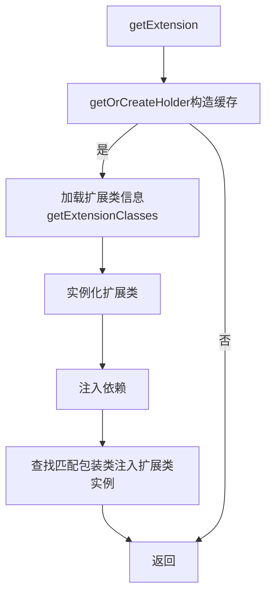

# dubbo源码解析之扩展点机制


本文主要分析dubbo的扩展点机制

<!--more-->

本文主要从一下四个问题分析Dubbo SPI机制

1.Java SPI是什么？

2.Dubbo SPI是什么？

3.Dubbo SPI是如何实现IOC和AOP的增强？

4.扩展点是如何实现的？

## 1.Java SPI是什么？

Service Provider Interface 服务提供接口，它是在resource文件夹下META-INF文件夹中创建一个类的全路径命名的一个文件，文件中的内容是实现类的全路径

## 2.Dubbo SPI是什么？

Dubbo SPI是在Java SPI的基础上实现了IOC和AOP功能的增强，它是在resource文件夹下META-INF文件夹中创建一个类路径命名的文件，文件中的内容有所不同，
文件中的格式是xxx=xxxxx这种形式

## 3.Dubbo SPI是如何实现IOC和AOP增强的？

Dubbo的SPI主要有以下四个特点

1.扩展点自动包装（自包装扩展了AOP）

2.扩展点自动装配（自装配扩展了IOC）

3.扩展点自适应（@Adaptive，这个是为了在需要的时候加载需要的扩展类）

加载扩展类有两种方式，一种是@SPI注解和静态文件，另一种是在方法上加上@Adaptive注解

4.扩展点自激活

自激活的场景是一个扩展类可能有多个扩展类的实现，需要对多个扩展类构造一个链表

## 4.扩展点是如何实现的？

我们以LoadBalance的扩展点加载为例去分析扩展点的实现，首先我们先找到LoadBalance的入口，在AbstractClusterInvoker中有initLoadBalance方法,代码如下

``` java
protected LoadBalance initLoadBalance(List<Invoker<T>> invokers, Invocation invocation) {
    if (CollectionUtils.isNotEmpty(invokers)) {
        // 1 根据类型获取Extension
        return ExtensionLoader.getExtensionLoader(LoadBalance.class).getExtension(invokers.get(0).getUrl()
                .getMethodParameter(RpcUtils.getMethodName(invocation), LOADBALANCE_KEY, DEFAULT_LOADBALANCE));
    } else {
        return ExtensionLoader.getExtensionLoader(LoadBalance.class).getExtension(DEFAULT_LOADBALANCE);
    }
}
```

首先我们可以看到ExtensionLoader.getExtensionLoader方法，它的入参是LoadBalance.class

```java
public static <T> ExtensionLoader<T> getExtensionLoader(Class<T> type) {
    if (type == null) {
        throw new IllegalArgumentException("Extension type == null");
    }
    // 判断类型是不是一个接口
    if (!type.isInterface()) {
        throw new IllegalArgumentException("Extension type (" + type + ") is not an interface!");
    }
    // 判断是否有扩展注解 @SPI
    if (!withExtensionAnnotation(type)) {
        throw new IllegalArgumentException("Extension type (" + type +
                ") is not an extension, because it is NOT annotated with @" + SPI.class.getSimpleName() + "!");
    }
    // 从ConcurrentHashMap中获取ExtensionLoader,key是ClassesLoader,如果没有，新创建一个ExtensionLoader放进Map中
    ExtensionLoader<T> loader = (ExtensionLoader<T>) EXTENSION_LOADERS.get(type);
    if (loader == null) {
        EXTENSION_LOADERS.putIfAbsent(type, new ExtensionLoader<T>(type));
        loader = (ExtensionLoader<T>) EXTENSION_LOADERS.get(type);
    }
    return loader;
}

```

从代码中我们可以看到，getExtensionLoader(Class<T> type) 方法只是从EXTENSION_LOADERS缓存中获取ExtensionLoader类，如果获取不到创建一个新的ExtensionLoader然后放进EXTENSION_LOADERS（用于缓存）中

接下来我们主要分析ExtensionLoader这个类里的实现
我们接着代码1处分析getExtension方法的实现

```java
public T getExtension(String name) {
    if (StringUtils.isEmpty(name)) {
        throw new IllegalArgumentException("Extension name == null");
    }
    if ("true".equals(name)) {
        return getDefaultExtension();
    }
    // 用于存放value，value是volatile类型
    final Holder<Object> holder = getOrCreateHolder(name);
    Object instance = holder.get();
    if (instance == null) {
        // 双重检查
        synchronized (holder) {
            instance = holder.get();
            if (instance == null) {
                // 根据Name创建实例
                instance = createExtension(name);
                holder.set(instance);
            }
        }
    }
    return (T) instance;
}
```

getExtension方法中可以看出调用了getOrCreateHolder方法，从getOrCreateHolder方法中可以看出这个方法是用来构建一个key为name,value为Holder实例的一个缓存cachedInstances

```java
private Holder<Object> getOrCreateHolder(String name) {
    Holder<Object> holder = cachedInstances.get(name);
    if (holder == null) {
        cachedInstances.putIfAbsent(name, new Holder<>());
        holder = cachedInstances.get(name);
    }
    return holder;
}

```

从getExtension方法中可以看出cachedInstances缓存是用来存放扩展类的实例的，存放的时候加了synchronized锁，使用了双重check机制，这个地方主要是用来防止高并发的时候在加锁前已经存放进去了扩展类实例，所以要二次get一下

接下来我们看createExtension方法，创建扩展类的方法


```java
private T createExtension(String name) {
    Class<?> clazz = getExtensionClasses().get(name);
    if (clazz == null) {
        throw findException(name);
    }
    try {
        T instance = (T) EXTENSION_INSTANCES.get(clazz);
        if (instance == null) {
            EXTENSION_INSTANCES.putIfAbsent(clazz, clazz.newInstance());
            instance = (T) EXTENSION_INSTANCES.get(clazz);
        }
        // 扩展点自动装配
        injectExtension(instance);
        // 扩展点自动包装
        Set<Class<?>> wrapperClasses = cachedWrapperClasses;
        if (CollectionUtils.isNotEmpty(wrapperClasses)) {
            for (Class<?> wrapperClass : wrapperClasses) {
                instance = injectExtension((T) wrapperClass.getConstructor(type).newInstance(instance));
            }
        }
        // 初始化扩展实例
        initExtension(instance);
        return instance;
    } catch (Throwable t) {
        throw new IllegalStateException("Extension instance (name: " + name + ", class: " +
                type + ") couldn't be instantiated: " + t.getMessage(), t);
    }
}

```

我们可以看到在创建扩展类之前会先获取一下扩展类，调用了getExtensionClasses方法

```java
// 获取扩展类
private Map<String, Class<?>> getExtensionClasses() {
    // 从缓存中获取扩展类
    Map<String, Class<?>> classes = cachedClasses.get();
    if (classes == null) {
        // 如果没有，加锁再获取一次
        // 考虑并发情况，加锁再获取一次
        synchronized (cachedClasses) {
            classes = cachedClasses.get();
            if (classes == null) {
                // 如果不存在，load扩展类，将扩展类放到缓存中
                classes = loadExtensionClasses();
                cachedClasses.set(classes);
            }
        }
    }
    return classes;
}

```

从代码中我们可以看出getExtensionClasses方法将扩展类放到了cachedClasses缓存中
如果缓存中存在扩展类直接返回，如果不存在进行一次load,调用了loadExtensionClasses()方法

```java
// 加载扩展类
private Map<String, Class<?>> loadExtensionClasses() {
    // 缓存默认的扩展名
    cacheDefaultExtensionName();

    Map<String, Class<?>> extensionClasses = new HashMap<>();
    // 加载所有的扩展类
    for (LoadingStrategy strategy : strategies) {
        loadDirectory(extensionClasses, strategy.directory(), type.getName(), strategy.preferExtensionClassLoader(), strategy.excludedPackages());
        loadDirectory(extensionClasses, strategy.directory(), type.getName().replace("org.apache", "com.alibaba"), strategy.preferExtensionClassLoader(), strategy.excludedPackages());
    }

    return extensionClasses;
}
```

此处加载扩展类会缓存默认的扩展名，会将扩展名放到cachedDefaultName中

```java
// 缓存默认扩展名称
private void cacheDefaultExtensionName() {
    // 获取SPI注解
    final SPI defaultAnnotation = type.getAnnotation(SPI.class);
    if (defaultAnnotation == null) {
        return;
    }
    // 获取注解value
    String value = defaultAnnotation.value();
    if ((value = value.trim()).length() > 0) {
        String[] names = NAME_SEPARATOR.split(value);
        if (names.length > 1) {
            throw new IllegalStateException("More than 1 default extension name on extension " + type.getName()
                    + ": " + Arrays.toString(names));
        }
        if (names.length == 1) {
            cachedDefaultName = names[0];
        }
    }
}
```

缓存默认的扩展名称获取的是SPI注解中的value字段，这个value字段只能有1个，大于1会抛出IllegalStateException异常信息

loadExtensionClasses方法中缓存完扩展名之后会加载资源文件夹下的所有扩展类，调用的是loadDirectory方法

接下来我们分析loadDirectory方法

```java
// 加载文件目录
private void loadDirectory(Map<String, Class<?>> extensionClasses, String dir, String type,
                            boolean extensionLoaderClassLoaderFirst, String... excludedPackages) {
    // 目录和type拼成文件名
    String fileName = dir + type;
    try {
        Enumeration<java.net.URL> urls = null;
        ClassLoader classLoader = findClassLoader();

        // try to load from ExtensionLoader's ClassLoader first
        if (extensionLoaderClassLoaderFirst) {
            ClassLoader extensionLoaderClassLoader = ExtensionLoader.class.getClassLoader();
            if (ClassLoader.getSystemClassLoader() != extensionLoaderClassLoader) {
                urls = extensionLoaderClassLoader.getResources(fileName);
            }
        }

        if (urls == null || !urls.hasMoreElements()) {
            if (classLoader != null) {
                urls = classLoader.getResources(fileName);
            } else {
                urls = ClassLoader.getSystemResources(fileName);
            }
        }

        if (urls != null) {
            while (urls.hasMoreElements()) {
                java.net.URL resourceURL = urls.nextElement();
                loadResource(extensionClasses, classLoader, resourceURL, excludedPackages);
            }
        }
    } catch (Throwable t) {
        logger.error("Exception occurred when loading extension class (interface: " +
                type + ", description file: " + fileName + ").", t);
    }
}
```
loadDirectory方法我们主要看loadResource方法

```java

private void loadResource(Map<String, Class<?>> extensionClasses, ClassLoader classLoader,
                              java.net.URL resourceURL, String... excludedPackages) {
    try {
        try (BufferedReader reader = new BufferedReader(new InputStreamReader(resourceURL.openStream(), StandardCharsets.UTF_8))) {
            String line;
            while ((line = reader.readLine()) != null) {
                final int ci = line.indexOf('#');
                if (ci >= 0) {
                    line = line.substring(0, ci);
                }
                line = line.trim();
                if (line.length() > 0) {
                    try {
                        String name = null;
                        int i = line.indexOf('=');
                        if (i > 0) {
                            name = line.substring(0, i).trim();
                            line = line.substring(i + 1).trim();
                        }
                        if (line.length() > 0 && !isExcluded(line, excludedPackages)) {
                            loadClass(extensionClasses, resourceURL, Class.forName(line, true, classLoader), name);
                        }
                    } catch (Throwable t) {
                        IllegalStateException e = new IllegalStateException("Failed to load extension class (interface: " + type + ", class line: " + line + ") in " + resourceURL + ", cause: " + t.getMessage(), t);
                        exceptions.put(line, e);
                    }
                }
            }
        }
    } catch (Throwable t) {
        logger.error("Exception occurred when loading extension class (interface: " +
                type + ", class file: " + resourceURL + ") in " + resourceURL, t);
    }
}
```

loadResource方法主要解析了以扩展类路径命名的文件中xxx=com.xxx.xxx这样的内容

我们主要看loadClass方法

```java

private void loadClass(Map<String, Class<?>> extensionClasses, java.net.URL resourceURL, Class<?> clazz, String name) throws NoSuchMethodException {
    if (!type.isAssignableFrom(clazz)) {
        throw new IllegalStateException("Error occurred when loading extension class (interface: " +
                type + ", class line: " + clazz.getName() + "), class "
                + clazz.getName() + " is not subtype of interface.");
    }
    // 判断类上的注解是否是Adaptive
    if (clazz.isAnnotationPresent(Adaptive.class)) {
        // 缓存Adaptive Class
        cacheAdaptiveClass(clazz);
    } else if (isWrapperClass(clazz)) {
        // 缓存包装类，Set集合
        cacheWrapperClass(clazz);
    } else {
        clazz.getConstructor();
        if (StringUtils.isEmpty(name)) {
            name = findAnnotationName(clazz);
            if (name.length() == 0) {
                throw new IllegalStateException("No such extension name for the class " + clazz.getName() + " in the config " + resourceURL);
            }
        }

        String[] names = NAME_SEPARATOR.split(name);
        if (ArrayUtils.isNotEmpty(names)) {
            cacheActivateClass(clazz, names[0]);
            for (String n : names) {
                // 缓存
                cacheName(clazz, n);
                // 保存扩展类
                saveInExtensionClass(extensionClasses, clazz, n);
            }
        }
    }
}
```

loadClass方法中主要缓存了带有Adaptive注解的自适应类,cachedAdaptiveClass和包装类，缓存了自激活类，name字段并且保存了扩展类

```java
// 缓存自适应类
private void cacheAdaptiveClass(Class<?> clazz) {
    if (cachedAdaptiveClass == null) {
        cachedAdaptiveClass = clazz;
    } else if (!cachedAdaptiveClass.equals(clazz)) {
        throw new IllegalStateException("More than 1 adaptive class found: "
                + cachedAdaptiveClass.getName()
                + ", " + clazz.getName());
    }
}
```
如果类上没有@Adaptive注解就判断这个类是不是包装类
```java
// 是否是包装类
 private boolean isWrapperClass(Class<?> clazz) {
    try {
        clazz.getConstructor(type);
        return true;
    } catch (NoSuchMethodException e) {
        return false;
    }
}
```
如果是包装类的话，将包装类缓存起来cachedWrapperClasses
```java
// 缓存包装类
private void cacheWrapperClass(Class<?> clazz) {
    if (cachedWrapperClasses == null) {
        cachedWrapperClasses = new ConcurrentHashSet<>();
    }
    cachedWrapperClasses.add(clazz);
}
```
如果既不是自适应类又不是包装类，就缓存自激活类
```java
// 缓存自激活类
private void cacheActivateClass(Class<?> clazz, String name) {
    Activate activate = clazz.getAnnotation(Activate.class);
    if (activate != null) {
        cachedActivates.put(name, activate);
    } else {
        // support com.alibaba.dubbo.common.extension.Activate
        com.alibaba.dubbo.common.extension.Activate oldActivate = clazz.getAnnotation(com.alibaba.dubbo.common.extension.Activate.class);
        if (oldActivate != null) {
            cachedActivates.put(name, oldActivate);
        }
    }
}
```
代码的最后就将扩展类保存进去
```java
// 保存扩展类
private void saveInExtensionClass(Map<String, Class<?>> extensionClasses, Class<?> clazz, String name) {
    Class<?> c = extensionClasses.get(name);
    if (c == null) {
        extensionClasses.put(name, clazz);
    } else if (c != clazz) {
        String duplicateMsg = "Duplicate extension " + type.getName() + " name " + name + " on " + c.getName() + " and " + clazz.getName();
        logger.error(duplicateMsg);
        throw new IllegalStateException(duplicateMsg);
    }
}
```

等这些资源加载完毕之后，我们再回到createExtension方法继续往下看，下面调用了injectExtension(instance)方法实现了扩展点的自动装配

```java
//注入扩展
private T injectExtension(T instance) {

    if (objectFactory == null) {
        return instance;
    }

    try {
        for (Method method : instance.getClass().getMethods()) {
            if (!isSetter(method)) {
                continue;
            }
            /**
                * Check {@link DisableInject} to see if we need auto injection for this property
                */
            if (method.getAnnotation(DisableInject.class) != null) {
                continue;
            }
            Class<?> pt = method.getParameterTypes()[0];
            if (ReflectUtils.isPrimitives(pt)) {
                continue;
            }

            try {
                String property = getSetterProperty(method);
                Object object = objectFactory.getExtension(pt, property);
                if (object != null) {
                    method.invoke(instance, object);
                }
            } catch (Exception e) {
                logger.error("Failed to inject via method " + method.getName()
                        + " of interface " + type.getName() + ": " + e.getMessage(), e);
            }

        }
    } catch (Exception e) {
        logger.error(e.getMessage(), e);
    }
    return instance;
}
```
这个方法实际就是调用了扩展类的set方法，将依赖的扩展类set进去

进行完了自动装配就开始进行自动包装

实际上自动包装就是调用了下面这一段方法,这一段方法中就是循环调用了injectExtension方法，只不过我们需要注意的是入参，
入参是包装类，所以包装的顺序是从最底层依次进行的，举一个例子就是
A里面有B，B里面有C,C里面有D

先从D开始包装DC,然后DCB,然后DCBA,一层一层向上包装

```java
// 扩展点自动包装
Set<Class<?>> wrapperClasses = cachedWrapperClasses;
if (CollectionUtils.isNotEmpty(wrapperClasses)) {
    for (Class<?> wrapperClass : wrapperClasses) {
        instance = injectExtension((T) wrapperClass.getConstructor(type).newInstance(instance));
    }
}
```

代码的最后就是初始化扩展实例
```java
// 初始化扩展
private void initExtension(T instance) {
    if (instance instanceof Lifecycle) {
        Lifecycle lifecycle = (Lifecycle) instance;
        lifecycle.initialize();
    }
}
```

以上我们将getExtension方法分析完毕,总结下来如下图所示

